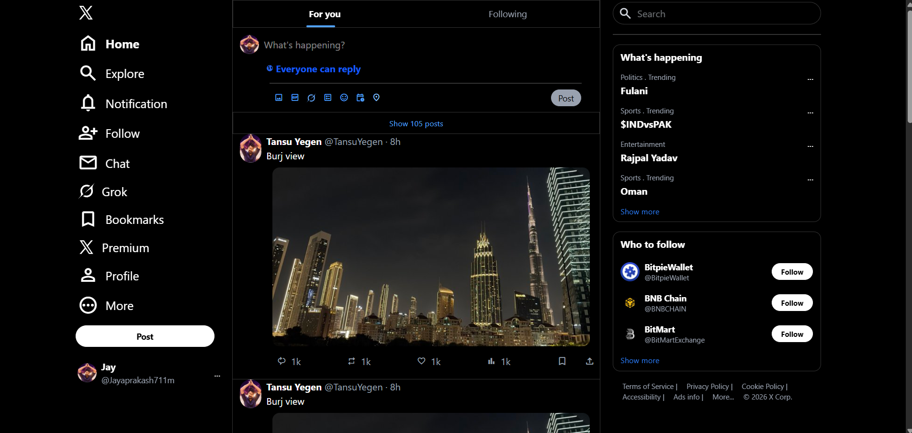
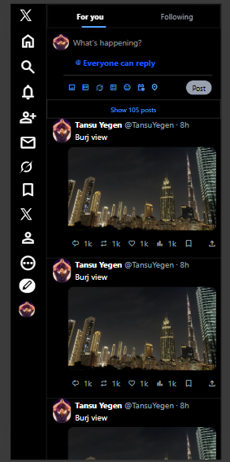

# 🐦 Twitter Clone (Tailwind CSS)


A responsive Twitter (X) UI clone built using **HTML and Tailwind CSS**.  
This project focuses on recreating the Twitter layout using utility-first styling and responsive design principles.

🔗 **Live Demo:**  
https://twitter-clone-eight-zeta-86.vercel.app/

---

## 📸 Screenshots

### 🖥 Desktop View


### 📱 Mobile View


---

## ✨ Features

- 🐦 Twitter-like sidebar layout  
- 🧭 Sticky navigation sections  
- 📱 Fully responsive design  
- 🎨 Utility-first styling with Tailwind  
- ⚡ Built Tailwind CSS workflow  
- 🧱 Clean component structure  

---

## 🛠 Tech Stack

- HTML5  
- Tailwind CSS  
- Node.js (for Tailwind build)  
- Vercel (Deployment)

---

## 📂 Project Structure

twitter-clone/
│
├── css/
│ ├── input.css
│ └── output.css
├── img/
├── .gitignore
├── favicon.ico
├── index.html
├── package-lock.json
├── package.json
├── profile.png
└── README.md


---

## ⚙️ Run Locally

```bash
git clone https://github.com/jayprakashm578/twitter-clone.git
cd twitter-clone
npm install
```
## ▶️ Build Tailwind
```bash
npx tailwindcss -i ./css/input.css -o ./css/output.css --watch
```

Then open index.html in your browser.

## 🧠 Key Learnings
- Tailwind utility-first workflow
- Setting up Tailwind build pipeline
- Responsive layout techniques
- Sticky positioning
- Clean semantic HTML structuring

## 🔮 Future Improvements
- 📝 Add tweet posting functionality
- ❤️ Like / retweet interactions
- 🔍 Search functionality
- 👤 User authentication
- 🌐 Full-stack backend integration
- ⚛️ React + Tailwind version

## 👨‍💻 Author
Jaya Prakash Mohanty
GitHub: https://github.com/jayprakashm578

